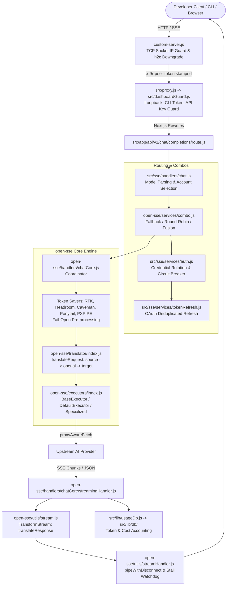

# Repository Guidelines

## Project Overview

9Router is an OpenAI/Anthropic/Codex compatible multi-provider AI gateway, intelligent router, and dashboard built with Next.js 16 (App Router + standalone HTTP wrapper) and an independent provider-agnostic core (`open-sse`).

The codebase is organized as a dual-artifact architecture:
- **`9router-app` (Root `package.json`)**: Next.js application providing the web dashboard (`/dashboard`), management REST APIs (`/api/*`), and compatibility gateway endpoints (`/v1/*`, `/v1beta/*`, `/responses`, `/codex/*`).
- **`9router` (`cli/package.json`)**: Standalone published npm CLI package that manages local daemon lifecycles, background runtime dependency bootstrapping, and platform system tray integration.

Target clients include developer CLI tools (Claude Code, Cursor, Codex CLI, Continue, OpenClaw, Roo, Cline), IDE extensions, custom agents, and browser clients.

---

## Architecture & Data Flow



### Request Lifecycle Phases

1. **Ingress & Security Wrapper (`custom-server.js`)**:
   - Derives client IP directly from `req.socket.remoteAddress` to prevent spoofing.
   - Strips untrusted `x-forwarded-for` and `x-real-ip` headers unless peer connects from verified loopback (`127.0.0.1`, `::1`).
   - Stamps valid requests with a random per-process secret header `x-9r-peer-token` (`NINEROUTER_PEER_TOKEN`).
   - Intercepts Cleartext HTTP/2 (`h2c`) upgrade requests (e.g. JetBrains IDEs) and cleanly downgrades them to HTTP/1.1 replays.
   - Initializes background OAuth token refresh timers on server `'listening'`.
2. **Path Security Guard (`src/proxy.js` -> `src/dashboardGuard.js`)**:
   - `PUBLIC_PREFIXES` (`/v1/*`, `/v1beta/*`, `/responses`, `/codex/*`): Allowed via local loopback, machine-ID-derived CLI token (`x-9r-cli-token`), or verified API key (`validateApiKey`).
   - `LOCAL_ONLY_PATHS` (`/api/cli-tools/*`, `/api/mcp/*`, `/api/tunnel/*`, `/api/headroom/*`): Restricted to verified local loopback or CLI token.
   - `ALWAYS_PROTECTED` (`/api/shutdown`, `/api/settings/database`): Requires valid JWT or local CLI token.
   - Protected Dashboard: Enforces JWT cookie authentication or honors `settings.requireLogin === false`.
3. **URL Rewrites (`next.config.mjs`)**:
   - `/v1/:path*` maps to `/api/v1/:path*`.
   - `/codex/:path*` and `/responses` map to `/api/v1/responses`.
4. **Chat Orchestration (`src/sse/handlers/chat.js`)**:
   - Strips client context markers (e.g. Claude Code `[1m]`).
   - Resolves model aliases and multi-model combo definitions (`src/sse/services/model.js`):
     - `fallback`: Sequentially attempts models upon failure.
     - `round-robin` / `sticky-round-robin`: Distributes traffic across models.
     - `fusion`: Parallel panel queries with consensus judge model synthesis.
     - Capacity adaptation: Automatically appends vision-capable combo models if the payload contains images (`augmentModelsWithCapacityAdapter`).
   - Selects active credentials and rotates away from rate-limited or locked-out accounts (`src/sse/services/auth.js`).
5. **Core Translation & Execution (`open-sse/handlers/chatCore.js`)**:
   - Detects source format (`openai`, `claude`, `gemini`, `openai-responses`).
   - Strips unsupported modalities (audio, PDF, image) based on target capabilities.
   - Pre-fetches remote image URLs to base64 if upstream lacks HTTP fetching.
   - Executes pre-dispatch token savers (RTK, Headroom, Caveman, Ponytail, PXPIPE) with strict fail-open semantics.
   - Translates request format (`open-sse/translator/index.js`).
   - Routes to executor (`open-sse/executors/`) and dispatches via `proxyAwareFetch` (HTTP/HTTPS/SOCKS5 proxies, Vercel relays).
6. **Streaming & SSE Translation (`open-sse/handlers/chatCore/streamingHandler.js`)**:
   - Pipes response chunks through Web Streams `TransformStream` (`open-sse/utils/stream.js`), translating chunks back to client format (`translateResponse`).
   - `pipeWithDisconnect` detects client aborts and upstream stalls (`STREAM_STALL_TIMEOUT_MS`, default 60s). Emits synthetic terminal frames (`[DONE]` or error) on abnormal termination.
   - Records latency, TTFT, token usage, and cost to SQLite via `src/lib/usageDb.js`.
7. **MITM Interception Subsystem (`src/mitm/`)**:
   - Dedicated TLS server on port 443 with dynamic leaf cert generation via `node-forge` signed by 9Router Root CA.
   - Dynamically modifies system `/etc/hosts` to redirect Copilot, Cursor, Kiro, and Google Cloud Code domains to `127.0.0.1`.
   - Resolves real upstream IPs using external Google DNS (`8.8.8.8`) to prevent recursive redirection.

---

## Key Directories

```
.
├── src/                         # Main Next.js application & server-side logic
│   ├── app/                     # App Router: API routes (api/v1/*, api/*) and Dashboard UI
│   ├── sse/                     # High-level gateway orchestration (chat, auth, model, combo)
│   ├── store/                   # Zustand client-side UI stores
│   ├── lib/                     # Data persistence (SQLite repos), auth, logging, usageDb
│   ├── mitm/                    # Local TLS proxy, Root CA management, DNS interception
│   ├── shared/                  # Shared provider metadata, models, and constants
│   ├── proxy.js                 # Edge middleware entry point
│   ├── dashboardGuard.js        # Path classification and authentication rules
│   └── instrumentation.js       # Server lifecycle hook (logging buffer, catalog sync)
├── open-sse/                    # Provider-agnostic streaming & translation engine
│   ├── handlers/                # Modality coordinators (chatCore, embeddingsCore, ttsCore...)
│   ├── executors/               # Upstream transport adapters (base, default, antigravity, cursor...)
│   ├── translator/              # Format translation hub (request, response, schema, concerns)
│   ├── rtk/                     # Request Token Killer (in-place tool_result compression)
│   ├── providers/               # Provider registries, capabilities matrix, default pricing
│   ├── services/                # Combos, account fallback, token refresh dedup
│   └── utils/                   # Stream helpers, stall handling, proxyFetch, error parsers
├── cli/                         # Companion npm CLI package (`9router`)
│   ├── src/                     # CLI runtime, process manager, platform systray
│   └── scripts/                 # CLI bundling (esbuild) and packaging
├── tests/                       # Independent ESM test suite (Vitest 4.0)
│   ├── unit/                    # 250+ unit tests (executors, DB migrations, auth, streaming)
│   ├── translator/              # Translation matrix, snapshots, it.fails bug tracking
│   ├── auth/                    # SAML 2.0 and identity tests
│   └── __baseline__/            # Regression verification scripts and known-fails.txt
├── scripts/                     # Operational, migration, and asset packaging utilities
├── skills/                      # Drop-in agent skill specifications (SKILL.md)
└── docs/                        # Architecture documentation and specs
```

---

## Development Commands

### Application Development & Build

```bash
# Install dependencies
npm install

# Run dev server (default port 20127)
npm run dev

# Run dev server with Webpack explicitly
npm run dev:webpack

# Run dev server under Bun runtime
npm run dev:bun

# Build standalone production distribution (Webpack + postbuild asset copying)
npm run build

# Build standalone distribution under Bun
npm run build:bun

# Start production server (wrapped in custom-server.js)
npm run start

# Start production standalone server under Bun
npm run start:bun
```

### Testing Commands

Tests reside in the independent ESM package `tests/` and require test dependencies installed:

```bash
# 1. Install root dependencies first (tests resolve @/ and open-sse modules)
npm install

# 2. Install test dependencies
cd tests && npm install

# Run all tests from root
npx vitest run --config tests/vitest.config.js

# Run all tests from tests/ directory
cd tests && npx vitest run

# Run a single test file
npx vitest run --config tests/vitest.config.js tests/unit/embeddingsCore.test.js

# Run translation matrix tests
npx vitest run --config tests/vitest.config.js tests/translator/

# Run live provider smoke tests (loads credentials from local SQLite DB)
RUN_REAL=1 npx vitest run --config tests/vitest.config.js tests/translator/real/

# Run live smoke for specific providers
RUN_REAL=1 REAL_PROVIDERS=kiro,codex npx vitest run --config tests/vitest.config.js tests/translator/real/

# Verify regression status against baseline known-fails whitelist
node tests/__baseline__/verify-no-regression.mjs

# Verify byte-for-byte stability of configurations
node tests/__baseline__/verify-providers.mjs
node tests/__baseline__/verify-alias.mjs
node tests/__baseline__/verify-oauth-urls.mjs
```

### Linting & Formatting

```bash
# Run ESLint (ESLint 9 Flat Config)
npx eslint .
```

### CLI Package Management

```bash
# Build and package the companion CLI tarball from root
npm run cli:pack

# Inside cli/ directory:
cd cli
npm run dev      # nodemon file watcher
npm run build    # bundle via esbuild
```

---

## Code Conventions & Common Patterns

### Module Resolution & Path Aliases

Configured in `jsconfig.json` and mirrored in `tests/vitest.config.js`:
- `@/*` maps to `./src/*`
- `open-sse` and `open-sse/*` map to `./open-sse/*`

### Translator Architecture & Registration

Format conversions use a **hub-and-spoke pattern** pivoting through OpenAI Chat Completions schema:
- Intermediate hop: `sourceFormat -> FORMATS.OPENAI -> targetFormat`
- Response hop: `targetFormat -> FORMATS.OPENAI -> sourceFormat`
- **Direct Routes (Lossless)**: Exact pairs (e.g. `claude:kiro`, `kiro:claude`) bypass the OpenAI pivot to preserve reasoning blocks, binary payloads, and tool metadata.

**Rules for Translators**:
1. Translators register via side-effects: `register(from, to, reqFn, resFn)`.
2. New translator modules **must** be imported in `open-sse/translator/index.js` or they will not register at runtime.
3. **Mandatory in Tests**: Vitest ESM does not evaluate dynamic bundler `require()`. Every translator test **MUST** import:
   ```javascript
   import "./registerAll.js";
   ```

### Error Handling & Fail-Open Contracts

- **Token Savers (RTK, Headroom, Caveman, Ponytail, PXPIPE)**: Strictly **fail-open**. Any error, timeout, or schema mismatch must catch gracefully, return the original unmodified payload, and allow execution to proceed. Never throw from token savers.
- **Account Failover & Circuit Breaking**: Upstream 429 (rate limit) or 5xx errors invoke `markAccountUnavailable` with exponential cooldowns and automatically cycle to the next active connection in the pool.
- **Streaming Disconnects**: `pipeWithDisconnect` buffers chunks, checks stall timeouts, and delays abort controller termination by 500ms on client disconnect to flush trailing logs and records cleanly. If headers were already sent, it enqueues a synthetic terminal error frame so the client parser does not crash.

### Asynchronous & Streaming Patterns

- **Web Streams**: All streaming uses standard `ReadableStream`, `TransformStream`, and `TextDecoder("utf-8", { fatal: false })` with `{ stream: true }`.
- **Line Buffering**: SSE streams split on `\n` while keeping unterminated chunks in a residual buffer (`buffer = lines.pop() || ""`) to prevent splitting multi-byte UTF-8 characters across chunk boundaries.
- **Token Refresh Deduplication**: `open-sse/services/tokenRefresh/dedup.js` ensures concurrent requests awaiting token renewal for the same connection attach to a single in-flight promise rather than launching duplicate OAuth refreshes.

### State Management & Persistence

- **Client State (Zustand in `src/store/`)**:
  - `providerStore.js` and `settingsStore.js` employ TTL caching (`CLIENT_STORE_TTL_MS`) to eliminate redundant fetches.
  - `patchSettings` performs optimistic state updates following `PATCH /api/settings` without secondary GET round-trips.
- **Server Persistence (SQLite in `src/lib/db/`)**:
  - Persistence uses the Repository Pattern (`src/lib/db/repos/`).
  - Multi-runtime driver fallback chain (`src/lib/db/driver.js`):
    `bun:sqlite` -> `better-sqlite3` -> `node:sqlite` -> `sql.js` (WASM).
  - Main database file: `${DATA_DIR}/db/data.sqlite` (defaults to `~/.9router/db/data.sqlite`).
  - `src/lib/localDb.js` is a legacy compatibility shim re-exporting `src/lib/db/index.js`.

### Logging Glyph Convention

Standardized console log markers:
- `▶`: Request ingress (`POST model → provider/model · FMT · STREAM/JSON`)
- `⚙`: Pre-processing / token saver applied (`RTK`, `CAVEMAN`, `PONYTAIL`)
- `🔑`: Token refreshed successfully
- `⇄`: Account failover triggered
- `📊`: Request completion summary (`200 OK · TTFT · Latency · Tokens`)
- `✗`: Error / upstream rejection

---

## Important Files

### Process Entry Points & Gateways
| File | Role |
| :--- | :--- |
| `custom-server.js` | Production Node HTTP server wrapper; validates TCP peer IP, downgrades h2c upgrades, initiates token refresh daemon. |
| `src/proxy.js` | Edge middleware entry point forwarding traffic to `dashboardGuard.js`. |
| `src/dashboardGuard.js` | Security gate enforcing loopback checks, CLI tokens, API keys, and session JWTs. |
| `src/instrumentation.js` | Next.js server lifecycle hook; boots console log capture and triggers model catalog sync. |
| `src/mitm/server.js` | Dedicated TLS server (:443) intercepting IDE traffic via dynamic cert generation. |
| `src/app/api/v1/chat/completions/route.js` | Gateway entry point for OpenAI chat completions. |

### Configuration Files
| File | Role |
| :--- | :--- |
| `package.json` | Project scripts, dependencies, optional dependencies, CLI pack commands. |
| `next.config.mjs` | Standalone output, 128MB proxy client body size, server external packages, API path rewrites. |
| `jsconfig.json` | Path aliases (`@/*`, `open-sse/*`) and compiler configuration. |
| `eslint.config.mjs` | ESLint 9 Flat Config extending Next.js core web vitals. |
| `tests/vitest.config.js` | Vitest runner configuration with 60 max concurrency and path aliases. |
| `Dockerfile` | Multi-stage Alpine containerization with standalone runtime packaging. |
| `docker-compose.yml` | Container deployment pairing 9Router with the Headroom token compression sidecar. |
| `.env.example` | Canonical environment variable reference. |

### Key Core Modules
| File | Role |
| :--- | :--- |
| `src/sse/handlers/chat.js` | High-level chat orchestrator (combo expansion, account failover, format bridge). |
| `src/sse/services/auth.js` | Provider credential selection, account rotation, and API key authentication. |
| `open-sse/handlers/chatCore.js` | Core chat coordinator: token savers, translation, executor dispatch. |
| `open-sse/handlers/chatCore/streamingHandler.js` | SSE response pipeline with stall detection and format translation. |
| `open-sse/executors/base.js` | Abstract executor with retry loop, exponential backoff, and proxyAwareFetch. |
| `open-sse/executors/default.js` | Standard OpenAI and Anthropic compatible upstream adapter. |
| `open-sse/translator/index.js` | Format translation registry with OpenAI pivot and direct routes. |
| `open-sse/rtk/index.js` | Request Token Killer: in-place compression of tool results. |
| `src/lib/db/driver.js` | Adaptive multi-runtime SQLite driver selection engine. |
| `src/lib/usageDb.js` | Token consumption, latency metrics, and request logging persistence. |

---

## Runtime & Tooling Preferences

### Runtime Requirements
- **Node.js**: Recommended Node.js **22 LTS** (`node:22-alpine` in Dockerfile). Minimum Node.js 18+.
  - Node.js `>= 22.5.0` provides built-in `node:sqlite`.
  - `better-sqlite3` is an `optionalDependency`; builds succeed even without C++ compilation tools thanks to the driver fallback chain (`node:sqlite` and pure-WASM `sql.js`).
- **Bun**: First-class support across development, building, and production:
  - `npm run dev:bun` and `npm run build:bun` require the `--webpack` flag.
  - Leverages native `bun:sqlite` adapter (`src/lib/db/adapters/bunSqliteAdapter.js`).

### Package Manager
- **Canonical Manager**: `npm` (`package-lock.json` v3).
- Do **not** use `pnpm` or `yarn` (no lockfiles are committed; ignored in Docker and build scripts).

### Tooling Constraints
- **Standalone Next.js**: Built with `output: "standalone"`. Next.js requires `node scripts/copy-standalone-assets.mjs` (`postbuild`) to copy static assets, public files, and `custom-server.js` into `.next/standalone/`.
- **External Packages**: The following native/dynamic packages **MUST** remain in `serverExternalPackages` inside `next.config.mjs`:
  ```javascript
  serverExternalPackages: ["better-sqlite3", "sql.js", "node:sqlite", "bun:sqlite", "open"]
  ```
  *Note on `open`*: Bundling `open` with Webpack freezes the build machine's absolute `import.meta.url` file paths, breaking cross-platform runtime execution. Keeping it external preserves dynamic resolution.
- **Large Request Payloads**: `proxyClientMaxBodySize` is set to `"128mb"` in `next.config.mjs` to allow massive LLM prompt contexts and base64 image data through API rewrites.

---

## Testing & QA

### Test Architecture
- **Runner**: Vitest 4.0 configured in `tests/vitest.config.js`.
- **Environment**: Node environment with `maxConcurrency: 60` for parallel execution.
- **Alternative Runners**: Select server and auth tests use native `node:test` (`tests/unit/custom-server-h2c.test.cjs`, `tests/auth/saml.test.js`).

### Test Organization
1. **Unit Tests (`tests/unit/`)**: 250+ isolated tests for executors, token refreshers, SQLite migrations, and security filters.
2. **Translator Tests (`tests/translator/`)**: Tests format conversion matrices (`matrix.js`), golden request snapshots (`__snapshots__/`), and direct bridge round-trips.
3. **Live Smoke Tests (`tests/translator/real/`)**: Live upstream tests gated behind `RUN_REAL=1` using saved credentials from the local database.
4. **Baseline Gating (`tests/__baseline__/`)**: Byte-for-byte config stability verification and regression detection.

### Critical Testing Conventions & Caveats

1. **Clean Checkout Expected Failures**:
   - A clean checkout has **26 catalogued failing tests** in `tests/__baseline__/known-fails.txt`.
   - Failures stem from uncommitted private cloud worker imports (`cloud/src/handlers/embeddings.js` in `unit/embeddings.cloud.test.js`) and unmocked external OAuth discovery endpoints.
   - **Gating Command**: Run `node tests/__baseline__/verify-no-regression.mjs` to verify that no *new* regressions were introduced.
2. **Mandatory Translator Registration**:
   - Translator tests **must** import `tests/translator/registerAll.js`. Without it, translator tables remain empty under Vitest ESM, causing tests to silently act as no-ops and produce false passes.
3. **Bug Tracking via `it.fails`**:
   - Confirmed, unfixed application bugs are written as `it.fails(...)`.
   - They pass in CI while the bug exists and turn red when fixed, prompting the author to convert them into permanent regression tests (`it(...)`).
4. **SSE & Stream Mocking**:
   - Stream mocks should use standard `ReadableStream` with `TextEncoder` and `data: ...\n\n` formatting. Aborts and mid-stream disconnects are simulated using `controller.error(new Error("socket hang up"))`.
5. **Temporary SQLite DB Isolation**:
   - Database tests should allocate a unique temporary directory (`fs.mkdtempSync`), point `process.env.DATA_DIR` to it, and cleanly close and delete the instance in `afterEach`.

---

## AI Agent Skills & Integration Guidelines

### 1. Skill Ecosystem (`skills/`)

The repository includes drop-in skill specifications (`SKILL.md`) enabling autonomous agents (Claude Code, Cursor, OpenClaw, Cline, Roo, custom agent SDKs) to self-configure and operate against 9Router without writing provider boilerplate.

- **Root Entry Point (`skills/9router/SKILL.md`)**:
  - The master bootstrap skill. AI agents load this skill first to discover gateway environment settings (`NINEROUTER_URL`, `NINEROUTER_KEY`), run health checks (`/api/health`), and access dynamic capability discovery endpoints.
  - Acts as an index pointing to modular capability skills hosted at raw GitHub URLs.
- **Conversational LLM Skill (`skills/9router-chat/SKILL.md`)**:
  - Dedicated conversational skill for LLM queries, code generation, summarization, and agent tool execution.
  - Documents dual-format endpoints (`/v1/chat/completions` and `/v1/messages`), multi-model fallback combos, SSE streaming shapes, and SDK client examples.
- **Modular Capability Skills Registry**:

| Skill Directory | Primary Endpoints | Target Capabilities & Providers | Raw Spec URL |
| :--- | :--- | :--- | :--- |
| `skills/9router` | `/api/health`, `/v1/models/*` | Gateway entry point, configuration, capability indexing | `https://raw.githubusercontent.com/decolua/9router/refs/heads/master/skills/9router/SKILL.md` |
| `skills/9router-chat` | `/v1/chat/completions`, `/v1/messages` | Chat, code generation, multi-turn reasoning, combos | `https://raw.githubusercontent.com/decolua/9router/refs/heads/master/skills/9router-chat/SKILL.md` |
| `skills/9router-image` | `/v1/images/generations` | Image generation (DALL-E 3, Gemini Imagen, FLUX, MiniMax) | `https://raw.githubusercontent.com/decolua/9router/refs/heads/master/skills/9router-image/SKILL.md` |
| `skills/9router-video` | `/v1/videos/generations`, `/v1/videos/{id}` | Async video generation and polling (xAI Grok Imagine) | `https://raw.githubusercontent.com/decolua/9router/refs/heads/master/skills/9router-video/SKILL.md` |
| `skills/9router-tts` | `/v1/audio/speech`, `/v1/audio/voices` | Text-to-speech (ElevenLabs, Edge-TTS, Deepgram, OpenAI) | `https://raw.githubusercontent.com/decolua/9router/refs/heads/master/skills/9router-tts/SKILL.md` |
| `skills/9router-stt` | `/v1/audio/transcriptions` | Speech-to-text / subtitles (Whisper, Groq, Gemini) | `https://raw.githubusercontent.com/decolua/9router/refs/heads/master/skills/9router-stt/SKILL.md` |
| `skills/9router-embeddings` | `/v1/embeddings` | Vector embeddings for RAG & semantic search (OpenAI, Gemini) | `https://raw.githubusercontent.com/decolua/9router/refs/heads/master/skills/9router-embeddings/SKILL.md` |
| `skills/9router-web-search` | `/v1/search` | Web & public X post search (Tavily, Exa, Brave, Xquik) | `https://raw.githubusercontent.com/decolua/9router/refs/heads/master/skills/9router-web-search/SKILL.md` |
| `skills/9router-web-fetch` | `/v1/web/fetch` | URL to markdown/HTML extraction (Jina Reader, Firecrawl, Tavily) | `https://raw.githubusercontent.com/decolua/9router/refs/heads/master/skills/9router-web-fetch/SKILL.md` |

---

### 2. Agent Environment & Authentication

#### Environment Variables
```bash
export NINEROUTER_URL="http://localhost:20128"      # Gateway base URL (local default or remote VPS/tunnel)
export NINEROUTER_KEY="sk-..."                      # API key from Dashboard → Keys (required if requireApiKey=true)
```

#### Authentication Mechanisms
1. **API Key Authentication (`Authorization: Bearer <key>` or `x-api-key: <key>`)**:
   - Validated against stored API keys via `validateApiKey`. Required for remote or non-loopback clients accessing `/v1/*`, `/v1beta/*`, `/responses`, or `/codex/*`.
2. **Local Loopback Exemption**:
   - Requests originating directly from verified loopback addresses (`127.0.0.1`, `::1`) bypass API key validation for public LLM endpoints, provided no proxy headers (`x-9r-via-proxy`) are present.
3. **Machine CLI Token (`x-9r-cli-token`)**:
   - Derived from host machine identity salted with `9r-cli-auth` (`getConsistentMachineId`).
   - Allows companion CLI tooling and local agent processes to access public LLM APIs as well as protected local routes (`/api/cli-tools/*`, `/api/mcp/*`, `/api/tunnel/*`, `/api/headroom/*`) without browser session cookies.
4. **Internal Peer Token (`x-9r-peer-token`)**:
   - Ephemeral random per-process secret generated on server boot by `custom-server.js` (`NINEROUTER_PEER_TOKEN`).
   - Stamped on incoming requests after TCP socket IP derivation to verify that downstream Next.js handlers (`dashboardGuard.js`) receive traffic routed through the trusted socket guard.

---

### 3. Model Addressing & Discovery

#### Addressing Conventions
- **Standard Format**: `provider/model` (e.g. `anthropic/claude-3-7-sonnet`, `gemini/gemini-2.5-pro`, `openai/gpt-4o`, `deepseek/deepseek-chat`).
- **Provider Aliases**: Configured in `src/shared/constants/providers.js` via `ALIAS_TO_ID` (e.g. `cc/*` for Claude Code / Anthropic, `el/*` for ElevenLabs, `xai/*` for xAI).
- **Inline Thinking Suffixes**: Models can declare inline reasoning intent using `model(value)` syntax:
  - Effort levels: `gemini-2.5-pro(high)`, `claude-3-7-sonnet(medium)`.
  - Exact token budgets: `claude-3-7-sonnet(16384)`, `gemini-2.5-flash(8192)`.
  - Disabling: `gpt-4o(none)` or `gpt-4o(off)`.

#### Multi-Model Combos (`owned_by: "combo"`)
Combos aggregate multiple underlying models under a unified virtual model name (e.g. `vip`, `fallback-combo`, `code-fast`):
- **Fallback Strategy (`fallback`)**: Sequentially attempts models in configured order when upstream errors (429, 5xx, locked accounts) occur.
- **Round-Robin Strategy (`round-robin` / `sticky-round-robin`)**: Distributes load across providers, with sticky affinity up to configured request thresholds.
- **Fusion Strategy (`fusion`)**: Dispatches the prompt to a panel of models in parallel and synthesizes the final response using a designated judge model.
- **Automatic Capacity Adaptation**: If a request payload contains image attachments, combos automatically adapt by appending vision-capable models (`augmentModelsWithCapacityAdapter`).

#### Dynamic Capability Discovery Endpoints
Agents discover models and operational capabilities programmatically via OpenAI-compatible endpoints:
- `GET /v1/models` — Complete catalog of active chat / LLM models and combos.
- `GET /v1/models/image` — Image generation models (e.g. `openai/dall-e-3`, `gemini/gemini-3-pro-image-preview`).
- `GET /v1/models/tts` — Text-to-speech models and voice IDs (`GET /v1/audio/voices?provider=...` for provider voice lists).
- `GET /v1/models/stt` — Speech-to-text models (e.g. `openai/whisper-1`, `groq/whisper-large-v3`).
- `GET /v1/models/embedding` — Vector embedding models.
- `GET /v1/models/web` — Web search and extraction models (entries include `kind: "webSearch"` or `kind: "webFetch"`).
- `GET /v1/models/image-to-text` — Vision-capable multimodal models.
- `GET /v1/models/info?id={provider/model}` — Detailed model specifications (context window sizes, dimensions, supported parameters, search configurations).

---

### 4. Chat Completions & Advanced Parameters

#### OpenAI & Anthropic Protocol Parity
- **OpenAI Format**: `POST /v1/chat/completions` accepting standard `messages`, `model`, `temperature`, `max_tokens`, `tools`, and `stream`.
- **Anthropic Format**: `POST /v1/messages` accepting Anthropic Messages API payloads with `anthropic-version: 2023-06-01`.

#### Streaming via Server-Sent Events (`stream: true`)
- Streams standard SSE data frames: `data: {"choices":[{"delta":{"content":"..."}}]}\n\n`.
- Stream closes with the terminal frame `data: [DONE]\n\n`.
- Thinking deltas are streamed in `delta.reasoning_content` (OpenAI format) or `content_block_delta` with `type: "thinking_delta"` (Anthropic format).

#### Thinking & Reasoning Parameter Normalization
9Router unifies thinking and reasoning parameters across upstream providers through `open-sse/translator/concerns/thinkingUnified.js`:
- **Accepted Client Inputs**:
  - OpenAI: `reasoning_effort` (`"minimal"`, `"low"`, `"medium"`, `"high"`, `"xhigh"`, `"max"`) or `reasoning: { effort: "..." }`.
  - Anthropic: `thinking: { type: "enabled"|"adaptive", budget_tokens: N }` or `output_config: { effort: "..." }`.
  - Gemini: `thinkingConfig: { thinkingLevel, thinkingBudget }`.
  - Qwen / DashScope: `enable_thinking: true`, `thinking_budget: N`.
  - Suffix override: `model(high)` or `model(8192)`.
- **Upstream Target Translation**:
  - **Anthropic (`claude-budget` / `claude-adaptive`)**:
    - Effort levels map to token budgets: `minimal` (512), `low` (1024), `medium` (8192), `high` (24576), `xhigh` (32768), `max` (128000).
    - Automatically enforces `max_tokens > budget_tokens + 1024` to prevent Anthropic 400 validation failures.
    - Adaptive models (Opus 4.5+, Sonnet 4.6+) receive `thinking: { type: "adaptive" }` with `output_config.effort`.
  - **Gemini (`gemini-level` / `gemini-budget`)**:
    - Translates effort to `thinkingConfig: { thinkingLevel: "minimal"|"low"|"medium"|"high", includeThoughts: true }`.
    - Automatically enforces output floor (`maxOutputTokens` raised up to 65535) so thinking token consumption does not truncate output text.
  - **OpenAI (`openai`)**:
    - Translates unified effort levels to native `reasoning_effort` strings.

#### Tools & Function Calling Support
- **Cross-Format Conversion**: Supports OpenAI `tools: [{ type: "function", function: { name, description, parameters } }]` and Anthropic `tools: [{ name, description, input_schema }]`.
- **Schema Sanitization**: Automatically strips non-standard schema keywords (e.g. Cursor styling properties `cornerRadius`, `fillColor`) when forwarding to schema-strict engines like Gemini/Antigravity.
- **ID & Argument Normalization**: Ensures every tool call carries a valid unique identifier conforming to Anthropic regex rules (`TOOL_ID_PATTERN`), ensuring clean round-trips for tool result messages.
- **Token Ceiling Protection**: Enforces a minimum `max_tokens` threshold (`DEFAULT_MIN_TOKENS`) whenever tool declarations are present to prevent truncated JSON arguments.
- **Anthropic Cache Control**: Automatically anchors 1-hour ephemeral cache breakpoints (`cache_control: { type: "ephemeral", ttl: "1h" }`) on the last eligible tool definition.
- **OAuth Anti-Ban Cloaking**: Automatically manages tool name prefixing and decloaking (`CLAUDE_TOOL_SUFFIX`) when routing through OAuth connections.

---

### 5. Agent Error Handling & Recovery Matrix

Autonomous agents communicating with 9Router should implement recovery strategies according to the following error matrix:

| HTTP Status | Error / Condition | Root Cause | Autonomous Agent Remediation Step |
| :--- | :--- | :--- | :--- |
| **400 Bad Request** | `Invalid model format` | Requested model ID is malformed or not found in capability catalog / combos. | Fetch `GET /v1/models` (or `/v1/models/<kind>`) to discover valid model IDs. Verify `provider/model` syntax. |
| **400 Bad Request** | Parameter mismatch (e.g. `max_tokens <= budget_tokens`, invalid schema) | Request payload violated upstream provider constraints. | When targeting Claude directly, ensure `max_tokens` exceeds `budget_tokens` by at least 1024. Clean unsupported tool schema properties. |
| **401 Unauthorized** | Missing or invalid API key | `settings.requireApiKey === true` and request lacks valid `NINEROUTER_KEY` or CLI token. | Verify `NINEROUTER_KEY` in environment. Include `Authorization: Bearer <key>`. For local processes, supply machine `x-9r-cli-token`. |
| **404 Not Found** | `No active credentials for provider: <provider>` | No accounts or API keys configured in 9Router for the targeted provider. | Switch model to an alternative active provider or a pre-configured multi-provider combo (`vip`). Alert user to connect credentials in Dashboard. |
| **429 Too Many Requests** | Upstream rate limit / quota exhaustion | Upstream provider account rate limits exhausted and all failover connections depleted. | Read `Retry-After` header. If immediate retry is required, switch to a fallback model or combo on a different provider. Back off exponentially. |
| **503 Service Unavailable** | `All accounts unavailable` | All configured accounts for provider are locked in cooldown circuit breakers (`allRateLimited`). | Parse `Retry-After` or `retryAfterHuman` from response. Fall back to a backup provider combo or pause requests until account cooldown expires. |
| **503 Service Unavailable** | Upstream provider outage / stall | Upstream gateway timeout, connection reset, or stream stall watchdog triggered. | Retry with exponential backoff and jitter. Switch to an independent provider to preserve agent execution continuity. |

<!-- BEGIN:nextjs-agent-rules -->

# This is NOT the Next.js you know

This version has breaking changes — APIs, conventions, and file structure may all differ from your training data. Read the relevant guide in `node_modules/next/dist/docs/` (resolved from this file's directory; in monorepos the `next` package may not be visible from the repo root) before writing any code. Heed deprecation notices.

This block is written and re-added by `next dev` — verify at `node_modules/next/dist/server/lib/generate-agent-files.js`. Removing it from a diff only re-creates the uncommitted change; committing it with your work keeps the tree clean.

<!-- END:nextjs-agent-rules -->
