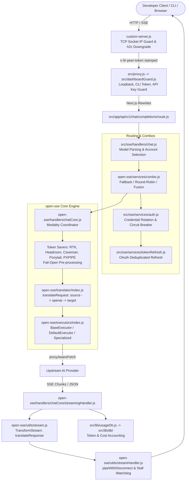

# Repository Guidelines

## Project Overview

9Router is an OpenAI/Anthropic/Codex compatible multi-provider AI gateway, intelligent router, and dashboard built with Next.js 16 (App Router + standalone HTTP wrapper) and an independent provider-agnostic core (`open-sse`). It unifies dozens of upstream AI providers (Anthropic Claude, OpenAI, Google Gemini/Antigravity, Codex, AWS Kiro, xAI Grok, DeepSeek, Ollama, Qwen, MiniMax, ElevenLabs, and more) behind standardized, production-ready APIs with intelligent fallback, credential rotation, rate limit circuit breakers, token-saving compression pipelines, and local developer IDE interception.

The codebase is organized as a dual-artifact architecture:
- **`9router-app` (Root `package.json`)**: Next.js 16 web application providing the management web dashboard (`/dashboard`), management REST APIs (`/api/*`), and compatibility gateway endpoints (`/v1/*`, `/v1beta/*`, `/responses`, `/codex/*`). Packaged as a standalone server (`output: "standalone"`) and containerized in Docker (`decolua/9router:latest`).
- **`9router` (`cli/package.json`)**: Published npm CLI package (`bin: { "9router": "./cli.js" }`) that embeds the stripped standalone server build inside `cli/app/`, manages local background daemon lifecycles, dynamically bootstraps native SQLite and systray runtimes in `~/.9router/runtime/node_modules`, and integrates with platform system trays.

Target clients include developer CLI tools (Claude Code, Cursor, Codex CLI, Continue, OpenClaw, Roo, Cline), IDE extensions (VS Code, JetBrains), custom AI agents, and browser clients.

---

## Architecture & Data Flow


```mermaid
flowchart TD
    Client([Developer Client / CLI / Browser]) -->|HTTP / SSE| CustomServer[custom-server.js\nTCP Socket IP Guard & h2c Downgrade]
    CustomServer -->|x-9r-peer-token stamped| Guard[src/proxy.js -> src/dashboardGuard.js\nLoopback, CLI Token, API Key Guard]
    Guard -->|Next.js Rewrites| AppRoute[src/app/api/v1/chat/completions/route.js]
    AppRoute --> SSEHandler[src/sse/handlers/chat.js\nModel Parsing & Account Selection]
    
    subgraph Routing & Combos
        SSEHandler --> ComboService[open-sse/services/combo.js\nFallback / Round-Robin / Fusion]
        ComboService --> AccountSelect[src/sse/services/auth.js\nCredential Rotation & Circuit Breaker]
        AccountSelect --> TokenRefresh[src/sse/services/tokenRefresh.js\nOAuth Deduplicated Refresh]
    end

    subgraph open-sse Core Engine
        ComboService --> ChatCore[open-sse/handlers/chatCore.js\nModality Coordinator]
        ChatCore --> TokenSavers[Token Savers: RTK, Headroom, Caveman, Ponytail, PXPIPE\nFail-Open Pre-processing]
        TokenSavers --> TranslatorReq[open-sse/translator/index.js\ntranslateRequest: source -> openai -> target]
        TranslatorReq --> Executor[open-sse/executors/index.js\nBaseExecutor / DefaultExecutor / Specialized]
    end

    Executor -->|proxyAwareFetch| Upstream[Upstream AI Provider]
    Upstream -->|SSE Chunks / JSON| StreamHandler[open-sse/handlers/chatCore/streamingHandler.js]
    StreamHandler --> TransformStream[open-sse/utils/stream.js\nTransformStream: translateResponse]
    TransformStream --> DisconnectHandler[open-sse/utils/streamHandler.js\npipeWithDisconnect & Stall Watchdog]
    DisconnectHandler --> Client
    StreamHandler --> UsageDB[src/lib/usageDb.js -> src/lib/db/\nToken & Cost Accounting]
```

### Request Lifecycle Phases

1. **Ingress & Security Wrapper (`custom-server.js`)**:
   - Intercepts incoming requests by monkey-patching `http.createServer`.
   - Derives client IP directly from the TCP socket (`req.socket.remoteAddress`) to prevent IP spoofing.
   - Evaluates forwarding headers (`x-forwarded-for`, `x-real-ip`) only if the TCP socket peer is a verified loopback proxy (`127.0.0.1`, `::1`, `::ffff:127.0.0.1`).
   - Strips client-supplied forwarding headers and stamps requests with an unspoofable per-process secret: `x-9r-peer-token` (`process.env.NINEROUTER_PEER_TOKEN`) and `x-9r-real-ip`. Sets `x-9r-via-proxy: "1"` if forwarded through a reverse proxy.
   - Intercepts Cleartext HTTP/2 (`h2c`) upgrade requests (commonly emitted by JetBrains IDEs / JBR 25) and transparently downgrades them to HTTP/1.1 replays via synthesized `IncomingMessage`.
   - Boots background token refresh timers on the server `'listening'` event.

2. **Path Security Guard (`src/proxy.js` -> `src/dashboardGuard.js`)**:
   - Validates `x-9r-peer-token` against `process.env.NINEROUTER_PEER_TOKEN` via `hasTrustedPeerHeaders(request)`.
   - Computes `isLocalRequest`: returns `false` if `x-9r-via-proxy` is present, or if peer IP or origin header are not loopback hostnames.
   - Route classification and authorization:
     - `PUBLIC_PREFIXES` (`/v1/*`, `/v1beta/*`, `/responses`, `/codex/*`): Allowed without credentials if `isLocalRequest` is true. Remote or proxied requests require a valid database API key (`extractApiKey`) or machine-ID-derived CLI token (`x-9r-cli-token`).
     - `LOCAL_ONLY_PATHS` (`/api/settings/database`, `/api/pxpipe/install`, `/api/shutdown`, `/api/cli-tools/*`, `/api/mcp/*`, `/api/tunnel/*`, `/api/headroom/*`): Restricted to verified local loopback or valid CLI token. Remote calls receive `403 Forbidden`.
     - `ALWAYS_PROTECTED` (`/api/keys`, `/api/auth/reset-password`): Requires valid session JWT cookie (`auth_token`) or CLI token.
     - Protected Dashboard (`/dashboard/*`): Enforces valid JWT cookie authentication or honors `settings.requireLogin === false`. Checks `settings.tunnelDashboardAccess` to optionally restrict remote tunnel access to the dashboard.

3. **URL Rewrites (`next.config.mjs`)**:
   - Transparently maps legacy and client-specific URL paths to App Router handlers:
     - `/v1/:path*` and `/v1/v1/:path*` $\to$ `/api/v1/:path*`
     - `/codex/:path*` and `/responses` $\to$ `/api/v1/responses`
     - `/v1beta/:path*` $\to$ `/api/v1beta/:path*`

4. **Chat Orchestration (`src/sse/handlers/chat.js`)**:
   - Normalizes input body and strips client context markers (e.g. Claude Code `<model>[1m]` $\to$ `<model>`).
   - Filters warmup and title-generation bypass requests (`handleBypassRequest`) so they do not exhaust model combo slots.
   - Detects required capabilities (multimodal images, tool calls, thinking intent).
   - Resolves model aliases and multi-model combo strategies (`open-sse/services/combo.js`):
     - `fallback`: Sequentially attempts configured models upon failure.
     - `round-robin` / `sticky-round-robin`: Distributes traffic across models, honoring sticky limits.
     - `fusion`: Parallel panel queries with consensus judge model synthesis.
     - Capacity adaptation (`augmentModelsWithCapacityAdapter`): Dynamically appends vision-capable fallback models if the input payload contains image attachments.
   - Selects active provider credentials via `getProviderCredentials` in `src/sse/services/auth.js` with per-model circuit breaker checking.

5. **Core Translation & Execution (`open-sse/handlers/chatCore.js`)**:
   - Detects source format (`openai`, `claude`, `gemini`, `openai-responses`).
   - Selects matching transport endpoint if supported natively by upstream (`zero-translation`).
   - Identifies native passthrough (`isNativePassthrough`): when client tool and provider share the same ecosystem (e.g. Claude Code to Claude, Codex CLI to Codex), format conversion is bypassed for lossless execution.
   - Strips unsupported media types (vision, audio, PDF) based on model capabilities (`stripUnsupportedModalities`).
   - Prefetches external image URLs to base64 for upstream targets that cannot fetch remote URLs (`prefetchRemoteImages`).
   - Executes pre-dispatch token savers (RTK, Headroom, Caveman, Ponytail, PXPIPE) with strict fail-open semantics.
   - Translates request format via `open-sse/translator/index.js`.
   - Obtains provider executor (`open-sse/executors/`) and dispatches via `proxyAwareFetch` (supporting direct, HTTP/HTTPS, SOCKS5, and Vercel relays).

6. **Streaming & SSE Translation (`open-sse/handlers/chatCore/streamingHandler.js`)**:
   - Catches non-SSE upstream responses (e.g. Cloudflare HTML 5xx challenge pages), extracts and sanitizes the `<title>`, and returns a clean JSON error response to prevent crashing Next.js streaming pipes.
   - Pipes response chunks through Web Streams `TransformStream` (`open-sse/utils/stream.js`), translating chunks back to client format (`translateResponse`).
   - `pipeWithDisconnect` monitors byte activity with a stall watchdog (`STREAM_STALL_TIMEOUT_MS`, default 30s).
   - Injects synthetic terminal frames (`[DONE]`, `event: error`, or OpenAI Responses `response.failed`) on unexpected drops so client parsers do not hang.
   - Persists latency, TTFT, token counts, and cost accounting to SQLite via `src/lib/usageDb.js`.

7. **MITM Interception Subsystem (`src/mitm/`)**:
   - Standalone HTTPS/HTTP2 server listening on port 443 with dynamic leaf certificate generation via `node-forge` signed by the 9Router Root CA.
   - Modifies system `/etc/hosts` or local DNS to redirect IDE traffic for Copilot, Cursor, Kiro, and Google Cloud Code domains to `127.0.0.1`.
   - Resolves true upstream destination IPs using external DNS (`8.8.8.8`) to avoid recursive interception loops.

---

## Key Directories

| Directory | Purpose |
| :--- | :--- |
| `src/app/` | Next.js App Router: API routes (`api/v1/*`, `api/*`, `oauth/*`) and Dashboard React UI. |
| `src/sse/` | Gateway orchestration: chat orchestration, credential selection, auth, and model resolution. |
| `src/store/` | Zustand client-side UI stores with TTL caching and optimistic updates. |
| `src/lib/` | Server infrastructure: SQLite repository pattern (`src/lib/db/`), usage accounting, logging, auth. |
| `src/mitm/` | Standalone port 443 TLS interception proxy, Root CA generation, and hosts file management. |
| `src/shared/` | Shared provider metadata, model definitions, pricing constants, and capability tables. |
| `open-sse/` | Provider-agnostic streaming and translation engine (zero Next.js coupling). |
| `open-sse/handlers/` | Modality coordinators (`chatCore`, `embeddingsCore`, `ttsCore`, `sttCore`, `imagesCore`, `videoCore`, `webCore`). |
| `open-sse/executors/` | Upstream transport adapters (`base`, `default`, `antigravity`, `codex`, `cursor`, `kiro`, etc.). |
| `open-sse/translator/` | Hub-and-spoke format translation hub (`request/`, `response/`, `schema/`, `concerns/`). |
| `open-sse/rtk/` | Token-saving preprocessors (RTK in-place compression, Headroom proxy, Caveman, Ponytail, PXPIPE). |
| `open-sse/providers/` | Provider capability definitions, thinking levels, and default pricing schemas. |
| `open-sse/services/` | Multi-model combos, capacity adapters, account fallback, and deduplicated token refresh. |
| `open-sse/utils/` | Stream helpers, stall handling, client detection, proxyFetch, and error parsers. |
| `cli/` | Companion npm CLI package (`9router`): process manager, binary wrapper, platform systray. |
| `tests/` | Independent ESM test suite (Vitest 4.0): 250+ unit tests, translator matrix, regression baseline. |
| `scripts/` | Build scripts (`copy-standalone-assets.mjs`), database migrations, and release utilities. |
| `skills/` | Drop-in AI agent skill specifications (`SKILL.md`) for autonomous agent integration. |
| `docs/` | Architecture specs, protocol mappings, and system documentation. |

---

## Development Commands

### Application Development & Build

```bash
# Install root dependencies
npm install

# Start Next.js development server (default port 20127)
npm run dev

# Start development server with explicit Webpack builder
npm run dev:webpack

# Start development server using Bun runtime
npm run dev:bun

# Build standalone production distribution (Webpack + postbuild asset copying)
npm run build

# Build standalone production distribution under Bun
npm run build:bun

# Start production server using custom-server wrapper (default port 20127)
npm start

# Start production standalone server under Bun
npm run start:bun
```

### Testing Commands

Tests reside in the independent ESM package `tests/`:

```bash
# 1. Install root dependencies first (tests resolve @/ and open-sse modules)
npm install

# 2. Install test dependencies
cd tests && npm install && cd ..

# Run all tests from root via Vitest
npx vitest run --config tests/vitest.config.js

# Run a single test file
npx vitest run --config tests/vitest.config.js tests/unit/embeddingsCore.test.js

# Run translation matrix tests
npx vitest run --config tests/vitest.config.js tests/translator/

# Run live provider smoke tests (loads credentials from local SQLite DB)
RUN_REAL=1 npx vitest run --config tests/vitest.config.js tests/translator/real/

# Run live smoke for specific providers
RUN_REAL=1 REAL_PROVIDERS=kiro,codex npx vitest run --config tests/vitest.config.js tests/translator/real/

# Verify regression status against baseline known-fails list
node tests/__baseline__/verify-no-regression.mjs

# Verify byte-for-byte configuration stability
node tests/__baseline__/verify-providers.mjs
node tests/__baseline__/verify-alias.mjs
node tests/__baseline__/verify-oauth-urls.mjs
```

### Linting & Formatting

```bash
# Run ESLint (ESLint 9 Flat Config)
npx eslint .
```

### Companion CLI Commands

```bash
# Build and package the companion CLI tarball (.tgz) from root
npm run cli:pack

# Build and publish the CLI package to npm registry
npm run cli:publish

# Run CLI file watcher during development
cd cli && npm run dev

# Build standalone CLI artifacts
cd cli && npm run build
```

---

## Code Conventions & Common Patterns

### Module Resolution & Path Aliases

Configured in `jsconfig.json` and mirrored in `tests/vitest.config.js`:
- `@/*` maps to `./src/*`
- `open-sse` maps to `./open-sse`
- `open-sse/*` maps to `./open-sse/*`

### Formatting & Naming Conventions
- **Files & Directories**: camelCase for service modules (`chatCore.js`, `tokenRefresh.js`), kebab-case for API route directories (`chat/completions/`), utility files (`stream-handler.js`), and test files (`headroom-detect.test.js`). PascalCase for class names and executors (`BaseExecutor`, `AntigravityExecutor`).
- **Logging Glyphs**: Console log lines use standardized symbols for high-visibility log streaming:
  - `▶`: Request ingress (`POST model → provider/model · FMT · STREAM/JSON · ACC:name`)
  - `⚙`: Pre-processing & token saver applied (`CAVEMAN:full`, `PXPIPE:2img`)
  - `🔑`: OAuth credential refreshed
  - `⇄`: Account failover triggered
  - `📊`: Request completion metrics (`done · TTFT · total latency · token counts`)
  - `✗`: Error / upstream rejection

### Translator Architecture & Registration

Format conversions use a **hub-and-spoke pattern** pivoting through the OpenAI Chat Completions schema:
- Request conversion: `sourceFormat -> FORMATS.OPENAI -> targetFormat`
- Response chunk conversion: `targetFormat -> FORMATS.OPENAI -> sourceFormat`
- **Direct Routes (Lossless)**: Exact pairs (e.g. `claude:kiro`, `kiro:claude`) bypass the OpenAI pivot to eliminate data loss during tool calling or reasoning output.

**Rules for Translators**:
1. Translators register via side-effects: `register(from, to, reqFn, resFn)`.
2. New translator modules **must** be statically imported in `open-sse/translator/index.js` or they will not register.
3. **Mandatory in Tests**: Every translator test **MUST** import `tests/translator/registerAll.js` at the top of the file to populate the registration table under Vitest ESM.

### Error Handling & Fail-Open Contracts
- **Token Savers (RTK, Headroom, Caveman, Ponytail, PXPIPE)**: Strictly **fail-open**. Any timeout, network error, or parsing failure must catch cleanly and return the uncompressed payload. Token savers must never abort or block user requests.
- **Circuit Breakers & Exponential Cooldown**: Upstream rate limits (429) or transient errors (5xx) record per-model locks (`modelLock_${model}`) in SQLite via `markAccountUnavailable`. Requests automatically cycle to the next active connection. Successful requests clear locks via `clearAccountError`.
- **Streaming Disconnects**: `pipeWithDisconnect` detects client aborts and upstream stalls (`STREAM_STALL_TIMEOUT_MS`). On abnormal termination after HTTP headers were already sent, it enqueues synthetic terminal frames (`[DONE]`, `event: error`, or `response.failed`) so downstream client parsers do not hang.

### Asynchronous & Streaming Patterns
- **Web Streams**: All streaming uses standard `ReadableStream`, `TransformStream`, and `TextDecoder("utf-8", { fatal: false })` with `{ stream: true }`.
- **Line Buffering**: SSE streams split on `\n` while keeping residual uncompleted data in a buffer (`buffer = lines.pop() || ""`) to prevent splitting multi-byte UTF-8 sequences.
- **Token Refresh Deduplication**: `open-sse/services/tokenRefresh/dedup.js` ensures concurrent requests awaiting token renewal for the same connection attach to a single in-flight promise with a 10-second result TTL.

### Dependency Injection & Modular Wiring
- **Executor Selection**: Executors are selected dynamically via `getExecutor(provider)` from `open-sse/executors/index.js`. Standard OpenAI and Anthropic compatible providers use `DefaultExecutor`; unique APIs use specialized executors inheriting from `BaseExecutor`.
- **Modular Modality Coordinators**: Distinct modalities are segregated into dedicated coordinators in `open-sse/handlers/`:
  - `chatCore.js` (Text chat, multi-turn reasoning, function calling)
  - `embeddingsCore.js` (Vector embeddings)
  - `ttsCore.js` (Text-to-speech)
  - `sttCore.js` (Speech-to-text transcriptions)
  - `imagesCore.js` (Image generation)
  - `videoCore.js` (Video generation)
  - `webCore.js` (Web search and URL content fetching)

### State Management & Persistence
- **Client State (Zustand in `src/store/`)**:
  - `providerStore.js` and `settingsStore.js` employ TTL caching (`CLIENT_STORE_TTL_MS = 60000`). Network requests are skipped if the cache is fresh unless `{ force: true }` is specified. Calling `invalidate()` resets `lastFetched: 0`.
  - Settings mutations perform optimistic updates via `patchSettings` without secondary GET requests.
- **Server Persistence (SQLite in `src/lib/db/`)**:
  - Database operations use the Repository Pattern (`src/lib/db/repos/`).
  - Adaptive multi-runtime driver fallback chain (`src/lib/db/driver.js`):
    `bun:sqlite` $\to$ `better-sqlite3` $\to$ `node:sqlite` $\to$ `sql.js` (WASM).
  - Main database file resides at `${DATA_DIR}/db/data.sqlite` (defaults to `~/.9router/db/data.sqlite`).
  - Database adapter instance is attached to `global._dbAdapter` to survive Next.js dev server hot-module reloads.

---

## Important Files

### Process Entry Points & Gateways

| File | Role |
| :--- | :--- |
| `custom-server.js` | Production Node.js HTTP server wrapper; derives TCP socket IP, stamps peer tokens, downgrades h2c upgrades, boots token refresh. |
| `src/proxy.js` | Next.js Edge proxy middleware entry point forwarding traffic to `dashboardGuard.js`. |
| `src/dashboardGuard.js` | Security gate enforcing loopback checks, CLI tokens, API keys, and session JWTs. |
| `src/instrumentation.js` | Next.js server lifecycle hook; boots console log capture and model catalog sync. |
| `src/mitm/server.js` | Dedicated TLS server (port 443) intercepting IDE traffic via dynamic cert generation. |
| `src/app/api/v1/chat/completions/route.js` | App Router gateway entry point for OpenAI chat completions. |

### Configuration Files

| File | Role |
| :--- | :--- |
| `package.json` | Project identity (`9router-app`), dependencies, build scripts, optional native addons. |
| `next.config.mjs` | Standalone output, 128MB proxy client body size, serverExternalPackages, path rewrites. |
| `jsconfig.json` | Path aliases (`@/*`, `open-sse/*`) and bundler module resolution rules. |
| `eslint.config.mjs` | ESLint 9 Flat Config extending Next.js core web vitals. |
| `tests/vitest.config.js` | Vitest runner configuration with 60 max concurrency and path aliases. |
| `Dockerfile` | Multi-stage Alpine containerization with standalone runtime packaging. |
| `docker-compose.yml` | Container deployment pairing 9Router with the Headroom token compression sidecar. |
| `.env.example` | Canonical environment variable reference. |

### Key Core Modules

| File | Role |
| :--- | :--- |
| `src/sse/handlers/chat.js` | Top-level chat orchestrator (combo expansion, account rotation, format bridging). |
| `src/sse/services/auth.js` | Provider credential selection mutex, account rotation strategies, circuit breakers. |
| `open-sse/handlers/chatCore.js` | Core chat coordinator: token savers, translation, executor dispatch. |
| `open-sse/handlers/chatCore/streamingHandler.js` | SSE streaming pipeline with non-SSE interception and stall watchdog. |
| `open-sse/executors/base.js` | Abstract executor base class with retry loops and `proxyAwareFetch`. |
| `open-sse/executors/default.js` | Standard OpenAI and Anthropic compatible upstream adapter. |
| `open-sse/translator/index.js` | Hub-and-spoke format translation registry with OpenAI pivot and direct bridges. |
| `open-sse/rtk/index.js` | Request Token Killer: in-place compression of tool result blocks. |
| `src/lib/db/driver.js` | Adaptive multi-runtime SQLite driver selection engine. |
| `src/lib/usageDb.js` | Token consumption, latency metrics, and request logging persistence. |

---

## Runtime & Tooling Preferences

### Runtime Requirements
- **Node.js**: Recommended Node.js **22 LTS** (`node:22-alpine` in Dockerfile). Minimum Node.js 18+.
  - Node.js $\ge 22.5.0$ provides native `node:sqlite`.
  - `better-sqlite3` is an `optionalDependency`; npm installation succeeds without C++ compilation tools by falling back to `node:sqlite` or pure-WASM `sql.js`.
- **Bun**: First-class support across development, building, and production:
  - `npm run dev:bun` and `npm run build:bun` require the `--webpack` flag.
  - Automatically loads the high-performance native `bun:sqlite` adapter.

### Package Manager
- **Canonical Manager**: `npm` (`package-lock.json` v3).
- Do **not** use `pnpm` or `yarn` (no lockfiles committed; explicitly unsupported by build scripts and Dockerfile).

### Tooling Constraints
- **Standalone Next.js**: Built with `output: "standalone"`. Standalone builds require running `node scripts/copy-standalone-assets.mjs` (`postbuild`) to copy static assets, public files, and `custom-server.js` into `.next/standalone/`.
- **External Packages**: The following packages **MUST** remain in `serverExternalPackages` inside `next.config.mjs`:
  ```javascript
  serverExternalPackages: ["better-sqlite3", "sql.js", "node:sqlite", "bun:sqlite", "open"]
  ```
  *Note on `open`*: Bundling `open` with Webpack replaces `import.meta.url` with the build machine's absolute file path, which throws an invalid file URL exception when run across different operating systems.
- **Large Request Payloads**: `proxyClientMaxBodySize` is set to `"128mb"` in `next.config.mjs` to allow massive LLM prompt contexts and high-resolution base64 multimodal inputs through API rewrites.

---

## Testing & QA

### Test Frameworks & Architecture
- **Runner**: Vitest 4.0 configured in `tests/vitest.config.js`.
- **Environment**: Node.js environment with `maxConcurrency: 60` for parallel execution.
- **Native Test Runner**: Specific runner-sensitive tests execute using native `node:test`:
  - `tests/unit/custom-server-h2c.test.cjs` (HTTP/2 cleartext downgrade)
  - `tests/auth/saml.test.js` (SAML cryptographic assertions)
  - `tests/unit/cline-auth.test.js`
  - `tests/unit/kimchi.test.js`

### Test Organization
1. **Unit Tests (`tests/unit/`)**: 250+ isolated tests covering executors, token refreshers, SQLite migrations, and security filters.
2. **Translator Tests (`tests/translator/`)**: Tests format conversion matrices (`matrix.js`), golden request snapshots (`__snapshots__/`), and direct bridge round-trips.
3. **Live Smoke Tests (`tests/translator/real/`)**: Live upstream tests gated behind `RUN_REAL=1` using saved credentials from the local database.
4. **Baseline Verification (`tests/__baseline__/`)**: Byte-for-byte configuration stability verification and regression detection.

### Critical Testing Conventions & Caveats

1. **Clean Checkout Expected Failure Baseline**:
   - A clean checkout has **26 catalogued failing tests** listed in `tests/__baseline__/known-fails.txt`.
   - Failures stem from uncommitted private cloud worker imports (`cloud/src/handlers/embeddings.js` in `unit/embeddings.cloud.test.js`) and unmocked external OAuth discovery endpoints.
   - **Zero Regression Rule**: Run `node tests/__baseline__/verify-no-regression.mjs` to verify that no *new* failures were introduced beyond the established baseline.
2. **Mandatory Translator Registration**:
   - Translator tests **must** import `tests/translator/registerAll.js`. Without this import, translator tables remain unpopulated under Vitest ESM, causing format conversions to silently fail.
3. **Bug Tracking via `it.fails`**:
   - Confirmed, unfixed application bugs are committed as `it.fails(...)`. They pass in CI while the bug exists and turn red when fixed, prompting conversion to standard regression tests (`it(...)`).
4. **SSE & Stream Mocking**:
   - Stream mocks must use standard `ReadableStream` with `TextEncoder` and `data: ...\n\n` framing. Aborts and mid-stream disconnects are simulated using `controller.error(new Error("socket hang up"))`.
5. **Temporary SQLite DB Isolation**:
   - Database tests must allocate a unique temporary directory (`fs.mkdtempSync`), point `process.env.DATA_DIR` to it, and cleanly close and delete the instance in `afterEach`.

---

## AI Agent Skills & Integration Guidelines

### 1. Skill Ecosystem (`skills/`)

The repository includes drop-in skill specifications (`SKILL.md`) enabling autonomous agents (Claude Code, Cursor, OpenClaw, Cline, Roo, custom agent SDKs) to self-configure and operate against 9Router without writing custom provider code.

- **Root Entry Point (`skills/9router/SKILL.md`)**: Master bootstrap skill. AI agents load this skill first to discover gateway environment settings (`NINEROUTER_URL`, `NINEROUTER_KEY`), run health checks (`/api/health`), and access dynamic capability discovery endpoints.
- **Conversational LLM Skill (`skills/9router-chat/SKILL.md`)**: Dedicated conversational skill for LLM queries, code generation, summarization, and agent tool execution. Documents dual-format endpoints (`/v1/chat/completions` and `/v1/messages`), multi-model fallback combos, and SSE streaming shapes.
- **Modular Capability Skills Registry**:

| Skill Directory | Primary Endpoints | Target Capabilities & Providers | Raw Spec URL |
| :--- | :--- | :--- | :--- |
| `skills/9router` | `/api/health`, `/v1/models/*` | Gateway entry point, configuration, capability indexing | `https://raw.githubusercontent.com/decolua/9router/refs/heads/master/skills/9router/SKILL.md` |
| `skills/9router-chat` | `/v1/chat/completions`, `/v1/messages` | Chat, code generation, multi-turn reasoning, combos | `https://raw.githubusercontent.com/decolua/9router/refs/heads/master/skills/9router-chat/SKILL.md` |
| `skills/9router-image` | `/v1/images/generations` | Image generation (DALL-E 3, Gemini Imagen, FLUX, MiniMax) | `https://raw.githubusercontent.com/decolua/9router/refs/heads/master/skills/9router-image/SKILL.md` |
| `skills/9router-video` | `/v1/videos/generations`, `/v1/videos/{id}` | Async video generation and polling (xAI Grok Imagine) | `https://raw.githubusercontent.com/decolua/9router/refs/heads/master/skills/9router-video/SKILL.md` |
| `skills/9router-tts` | `/v1/audio/speech`, `/v1/audio/voices` | Text-to-speech (ElevenLabs, Edge-TTS, Deepgram, OpenAI) | `https://raw.githubusercontent.com/decolua/9router/refs/heads/master/skills/9router-tts/SKILL.md` |
| `skills/9router-stt` | `/v1/audio/transcriptions` | Speech-to-text / subtitles (Whisper, Groq, Gemini) | `https://raw.githubusercontent.com/decolua/9router/refs/heads/master/skills/9router-stt/SKILL.md` |
| `skills/9router-embeddings` | `/v1/embeddings` | Vector embeddings for RAG & semantic search (OpenAI, Gemini) | `https://raw.githubusercontent.com/decolua/9router/refs/heads/master/skills/9router-embeddings/SKILL.md` |
| `skills/9router-web-search` | `/v1/search` | Web & public X post search (Tavily, Exa, Brave, Xquik) | `https://raw.githubusercontent.com/decolua/9router/refs/heads/master/skills/9router-web-search/SKILL.md` |
| `skills/9router-web-fetch` | `/v1/web/fetch` | URL to markdown/HTML extraction (Jina Reader, Firecrawl, Tavily) | `https://raw.githubusercontent.com/decolua/9router/refs/heads/master/skills/9router-web-fetch/SKILL.md` |

---

### 2. Agent Environment & Authentication

#### Environment Variables
```bash
export NINEROUTER_URL="http://localhost:20128"      # Gateway base URL (local default or remote VPS/tunnel)
export NINEROUTER_KEY="sk-..."                      # API key from Dashboard → Keys (required if requireApiKey=true)
```

#### Authentication Mechanisms
1. **API Key Authentication (`Authorization: Bearer <key>` or `x-api-key: <key>`)**: Validated against stored API keys via `validateApiKey`. Required for remote or non-loopback clients accessing `/v1/*`, `/v1beta/*`, `/responses`, or `/codex/*`.
2. **Local Loopback Exemption**: Requests originating directly from verified loopback addresses (`127.0.0.1`, `::1`) bypass API key validation for public LLM endpoints, provided no proxy headers (`x-9r-via-proxy`) are present.
3. **Machine CLI Token (`x-9r-cli-token`)**: Derived from host machine identity salted with `9r-cli-auth` (`getConsistentMachineId`). Allows companion CLI tooling and local agent processes to access public LLM APIs as well as protected local routes (`/api/cli-tools/*`, `/api/mcp/*`, `/api/tunnel/*`, `/api/headroom/*`) without browser session cookies.
4. **Internal Peer Token (`x-9r-peer-token`)**: Ephemeral random per-process secret generated on server boot by `custom-server.js` (`NINEROUTER_PEER_TOKEN`). Stamped on incoming requests after TCP socket IP derivation to verify that downstream Next.js handlers (`dashboardGuard.js`) receive traffic routed through the trusted socket guard.

---

### 3. Model Addressing & Discovery

#### Addressing Conventions
- **Standard Format**: `provider/model` (e.g. `anthropic/claude-3-7-sonnet`, `gemini/gemini-2.5-pro`, `openai/gpt-4o`, `deepseek/deepseek-chat`).
- **Provider Aliases**: Configured in `src/shared/constants/providers.js` via `ALIAS_TO_ID` (e.g. `cc/*` for Claude Code / Anthropic, `el/*` for ElevenLabs, `xai/*` for xAI).
- **Inline Thinking Suffixes**: Models can declare inline reasoning intent using `model(value)` syntax:
  - Effort levels: `gemini-2.5-pro(high)`, `claude-3-7-sonnet(medium)`.
  - Exact token budgets: `claude-3-7-sonnet(16384)`, `gemini-2.5-flash(8192)`.
  - Disabling: `gpt-4o(none)` or `gpt-4o(off)`.

#### Multi-Model Combos (`owned_by: "combo"`)
Combos aggregate multiple underlying models under a unified virtual model name (e.g. `vip`, `fallback-combo`, `code-fast`):
- **Fallback Strategy (`fallback`)**: Sequentially attempts models in configured order when upstream errors (429, 5xx, locked accounts) occur.
- **Round-Robin Strategy (`round-robin` / `sticky-round-robin`)**: Distributes load across providers, with sticky affinity up to configured request thresholds.
- **Fusion Strategy (`fusion`)**: Dispatches the prompt to a panel of models in parallel and synthesizes the final response using a designated judge model.
- **Automatic Capacity Adaptation**: If a request payload contains image attachments, combos automatically adapt by appending vision-capable models (`augmentModelsWithCapacityAdapter`).

#### Dynamic Capability Discovery Endpoints
Agents discover models and operational capabilities programmatically via OpenAI-compatible endpoints:
- `GET /v1/models` — Complete catalog of active chat / LLM models and combos.
- `GET /v1/models/image` — Image generation models (e.g. `openai/dall-e-3`, `gemini/gemini-3-pro-image-preview`).
- `GET /v1/models/tts` — Text-to-speech models and voice IDs (`GET /v1/audio/voices?provider=...` for provider voice lists).
- `GET /v1/models/stt` — Speech-to-text models (e.g. `openai/whisper-1`, `groq/whisper-large-v3`).
- `GET /v1/models/embedding` — Vector embedding models.
- `GET /v1/models/web` — Web search and extraction models (entries include `kind: "webSearch"` or `kind: "webFetch"`).
- `GET /v1/models/image-to-text` — Vision-capable multimodal models.
- `GET /v1/models/info?id={provider/model}` — Detailed model specifications (context window sizes, dimensions, supported parameters, search configurations).

---

### 4. Chat Completions & Advanced Parameters

#### OpenAI & Anthropic Protocol Parity
- **OpenAI Format**: `POST /v1/chat/completions` accepting standard `messages`, `model`, `temperature`, `max_tokens`, `tools`, and `stream`.
- **Anthropic Format**: `POST /v1/messages` accepting Anthropic Messages API payloads with `anthropic-version: 2023-06-01`.

#### Streaming via Server-Sent Events (`stream: true`)
- Streams standard SSE data frames: `data: {"choices":[{"delta":{"content":"..."}}]}\n\n`.
- Stream closes with the terminal frame `data: [DONE]\n\n`.
- Thinking deltas are streamed in `delta.reasoning_content` (OpenAI format) or `content_block_delta` with `type: "thinking_delta"` (Anthropic format).

#### Thinking & Reasoning Parameter Normalization
9Router unifies thinking and reasoning parameters across upstream providers through `open-sse/translator/concerns/thinkingUnified.js`:
- **Accepted Client Inputs**:
  - OpenAI: `reasoning_effort` (`"minimal"`, `"low"`, `"medium"`, `"high"`, `"xhigh"`, `"max"`) or `reasoning: { effort: "..." }`.
  - Anthropic: `thinking: { type: "enabled"|"adaptive", budget_tokens: N }` or `output_config: { effort: "..." }`.
  - Gemini: `thinkingConfig: { thinkingLevel, thinkingBudget }`.
  - Qwen / DashScope: `enable_thinking: true`, `thinking_budget: N`.
  - Suffix override: `model(high)` or `model(8192)`.
- **Upstream Target Translation**:
  - **Anthropic (`claude-budget` / `claude-adaptive`)**:
    - Effort levels map to token budgets: `minimal` (512), `low` (1024), `medium` (8192), `high` (24576), `xhigh` (32768), `max` (128000).
    - Automatically enforces `max_tokens > budget_tokens + 1024` to prevent Anthropic 400 validation failures.
    - Adaptive models (Opus 4.5+, Sonnet 4.6+) receive `thinking: { type: "adaptive" }` with `output_config.effort`.
  - **Gemini (`gemini-level` / `gemini-budget`)**:
    - Translates effort to `thinkingConfig: { thinkingLevel: "minimal"|"low"|"medium"|"high", includeThoughts: true }`.
    - Automatically enforces output floor (`maxOutputTokens` raised up to 65535) so thinking token consumption does not truncate output text.
  - **OpenAI (`openai`)**:
    - Translates unified effort levels to native `reasoning_effort` strings.

#### Tools & Function Calling Support
- **Cross-Format Conversion**: Supports OpenAI `tools: [{ type: "function", function: { name, description, parameters } }]` and Anthropic `tools: [{ name, description, input_schema }]`.
- **Schema Sanitization**: Automatically strips non-standard schema keywords (e.g. Cursor styling properties `cornerRadius`, `fillColor`) when forwarding to schema-strict engines like Gemini/Antigravity.
- **ID & Argument Normalization**: Ensures every tool call carries a valid unique identifier conforming to Anthropic regex rules (`TOOL_ID_PATTERN`), ensuring clean round-trips for tool result messages.
- **Token Ceiling Protection**: Enforces a minimum `max_tokens` threshold (`DEFAULT_MIN_TOKENS`) whenever tool declarations are present to prevent truncated JSON arguments.
- **Anthropic Cache Control**: Automatically anchors 1-hour ephemeral cache breakpoints (`cache_control: { type: "ephemeral", ttl: "1h" }`) on the last eligible tool definition.
- **OAuth Anti-Ban Cloaking**: Automatically manages tool name prefixing and decloaking (`CLAUDE_TOOL_SUFFIX`) when routing through OAuth connections.

---

### 5. Agent Error Handling & Recovery Matrix

Autonomous agents communicating with 9Router should implement recovery strategies according to the following error matrix:

| HTTP Status | Error / Condition | Root Cause | Autonomous Agent Remediation Step |
| :--- | :--- | :--- | :--- |
| **400 Bad Request** | `Invalid model format` | Requested model ID is malformed or not found in capability catalog / combos. | Fetch `GET /v1/models` (or `/v1/models/<kind>`) to discover valid model IDs. Verify `provider/model` syntax. |
| **400 Bad Request** | Parameter mismatch (e.g. `max_tokens <= budget_tokens`, invalid schema) | Request payload violated upstream provider constraints. | When targeting Claude directly, ensure `max_tokens` exceeds `budget_tokens` by at least 1024. Clean unsupported tool schema properties. |
| **401 Unauthorized** | Missing or invalid API key | `settings.requireApiKey === true` and request lacks valid `NINEROUTER_KEY` or CLI token. | Verify `NINEROUTER_KEY` in environment. Include `Authorization: Bearer <key>`. For local processes, supply machine `x-9r-cli-token`. |
| **404 Not Found** | `No active credentials for provider: <provider>` | No accounts or API keys configured in 9Router for the targeted provider. | Switch model to an alternative active provider or a pre-configured multi-provider combo (`vip`). Alert user to connect credentials in Dashboard. |
| **429 Too Many Requests** | Upstream rate limit / quota exhaustion | Upstream provider account rate limits exhausted and all failover connections depleted. | Read `Retry-After` header. If immediate retry is required, switch to a fallback model or combo on a different provider. Back off exponentially. |
| **503 Service Unavailable** | `All accounts unavailable` | All configured accounts for provider are locked in cooldown circuit breakers (`allRateLimited`). | Parse `Retry-After` or `retryAfterHuman` from response. Fall back to a backup provider combo or pause requests until account cooldown expires. |
| **503 Service Unavailable** | Upstream provider outage / stall | Upstream gateway timeout, connection reset, or stream stall watchdog triggered. | Retry with exponential backoff and jitter. Switch to an independent provider to preserve agent execution continuity. |

<!-- BEGIN:nextjs-agent-rules -->

# This is NOT the Next.js you know

This version has breaking changes — APIs, conventions, and file structure may all differ from your training data. Read the relevant guide in `node_modules/next/dist/docs/` (resolved from this file's directory; in monorepos the `next` package may not be visible from the repo root) before writing any code. Heed deprecation notices.

This block is written and re-added by `next dev` — verify at `node_modules/next/dist/server/lib/generate-agent-files.js`. Removing it from a diff only re-creates the uncommitted change; committing it with your work keeps the tree clean.

<!-- END:nextjs-agent-rules -->
